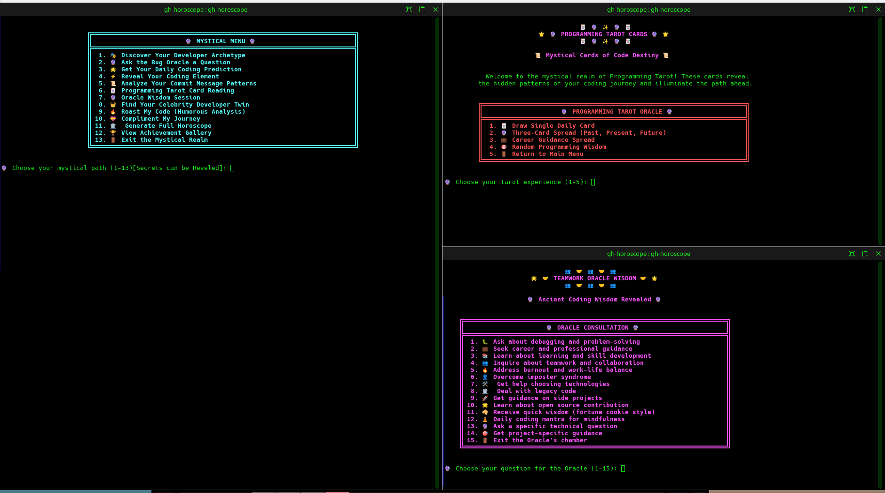

# 🔮 GitHub CLI Horoscope Extension
 
Hey there! So I made this absolutely ridiculous horoscope thing for GitHub, I don't have my own thoughts they suggested i provided. It looks at your coding habits and tells your "digital fortune" like some kind of mystical code wizard. Started as a joke, ended up being genuinely useful (and hilarious).

## ✨ What This Thing Actually Does

Okay, so this isn't your grandma's horoscope. This thing digs deep into your GitHub data and comes up with surprisingly accurate (and hilariously invasive) insights about your coding life:

### 🎭 **The Main Event - Your Coding Personality**
- 🦉 **Night Owl Detection**: Calls you out for those 3 AM "quick fixes"
- 📝 **Commit Message Analysis**: Judges your "fix stuff" and "it works now" messages
- ⚔️ **Weekend Warrior Score**: Measures how much you code when you should be living
- 🎭 **Developer Archetype**: Figures out if you're a "Copy-Paste Virtuoso" or "Documentation Ghost" (35+ types!)
- ⚖️ **GitHub Karma**: Your open source street cred, quantified
- 🌟 **Daily Predictions**: Actually useful advice disguised as mystical nonsense

### 🔮 **The Oracle System** (This is where it gets crazy good)
I built this whole Oracle thing that gives you personalized coding wisdom based on your actual GitHub patterns. It's like having a wise coding mentor, but mystical:

```bash
gh horoscope --oracle career-guidance      # Career advice based on your language portfolio
gh horoscope --oracle debugging-wisdom     # Debug help from your commit patterns  
gh horoscope --oracle burnout-check        # Checks if you're coding too much (spoiler: you are)
gh horoscope --oracle skill-development    # Learning recommendations from your repos
gh horoscope --oracle team-collaboration   # Teamwork insights from your PR patterns
```

Plus 5 more oracle types: `project-focus`, `coding-rhythm`, `technical-growth`, `open-source-path`, `language-mastery`

### 🃏 **Programming Tarot Cards** 
Yeah, I made a whole tarot deck for programmers. Draw cards like "The Merge Conflict", "Stack Overflow Guidance", and "The Infinite Loop". It's surprisingly therapeutic.

```bash
gh horoscope --tarot    # Full mystical card reading
```

### 🔥 **Roast Mode** (My personal favorite)
This is where I got a little too creative. It analyzes your coding patterns and lovingly roasts you with observations like:
- *"You collect frameworks like Pokémon cards"*
- *"Your commit messages tell the tragic story of software development"*
- *"You write code like you're protecting state secrets"*

```bash
gh horoscope --roast username    # Gentle, loving mockery
gh horoscope --compliment username    # For when you need a hug instead
```

### 👑 **Celebrity Developer Matching**
Find your coding doppelganger! Compare yourself with legends like Linus Torvalds, or just see which celebrity developer you code like:

```bash
gh horoscope --celebrity torvalds     # Compare with the Linux legend
gh horoscope --doppelganger          # Find your coding twin
gh horoscope --list-celebrities      # See all available legends
```

### 🎪 **Interactive Mode** (The full experience)
This is the crown jewel - a beautiful interactive menu where you can explore all 12 mystical paths:

```bash
gh horoscope --interactive
```

You get ASCII art, crystal ball displays, and a proper mystical journey through your coding soul.

## 🚀 Getting Started

### Recommended: Install as a GitHub CLI Extension

If you have GitHub CLI installed, just run:

```bash
gh extension install CyberNaught-XyZ/Github-CLI-horoscope
```

Then use:

```bash
gh horoscope
```

### Or: Use the Setup Script

If you prefer, you can run the provided setup script:

```bash
./setup.sh
```

This will guide you through any required steps.

## 🎯 How To Use This Magic

### The Basics (Start Here!)

```bash
# Your own mystical coding journey
gh horoscope

# Spy on someone else's coding patterns
gh horoscope octocat

# Get the full detailed analysis (prepare for TMI about your coding habits)
gh horoscope -v
```

### The Fun Stuff (Where It Gets Interesting)

```bash
# Interactive mystical experience (this is THE way to use it)
gh horoscope --interactive

# Get mystical coding advice based on your actual GitHub data
gh horoscope --oracle career-guidance
gh horoscope --oracle debugging-wisdom  
gh horoscope --oracle burnout-check

# Programming tarot reading (don't judge, it's surprisingly accurate)
gh horoscope --tarot

# Lovingly roast someone's coding style
gh horoscope --roast username

# Or be nice for once
gh horoscope --compliment username

# Find your celebrity coding doppelganger
gh horoscope --doppelganger

# Compare with coding legends
gh horoscope --celebrity torvalds

# See all available coding celebrities
gh horoscope --list-celebrities

# Compare two developers (drama mode)
gh horoscope --compare user1 user2

# Quick reading for the impatient
gh horoscope --quick

# Export your fortune to share with friends
gh horoscope --export ~/my_coding_fortune.txt
```

### All The Oracle Types (Because Variety Is The Spice Of Life)

The Oracle system is probably my favorite part. Each one analyzes different aspects of your GitHub data:

- `career-guidance` - Career advice based on your language portfolio and repo diversity
- `debugging-wisdom` - Debugging insights from your commit patterns and timing
- `burnout-check` - Health check based on your commit frequency (spoiler: take a break)
- `skill-development` - Learning recommendations from your language usage patterns
- `team-collaboration` - Teamwork insights from your PR and collaboration patterns  
- `project-focus` - Focus advice based on your repo abandonment patterns (we see you)
- `coding-rhythm` - Productivity insights from your commit timing patterns
- `technical-growth` - Growth guidance from your code complexity evolution
- `open-source-path` - Community advice based on your public contributions
- `language-mastery` - Specialization guidance from your language usage trends

## 🎭 What You'll Actually See



Here's what happens when you run this thing (prepare for terminal magic):

```
    ╔══════════════════════════════════════════════════════════════════════╗
    ║                     🔮 GITHUB CRYSTAL BALL 🔮                        ║
    ║                                                                      ║
    ║     ✨ Mystical Analysis of Your Coding Patterns ✨                  ║
    ║                                                                      ║
    ║         .-.                                                          ║
    ║       .'{o}'.                                                        ║
    ║      (_/_\_)          "The commits reveal all..."                    ║
    ║       d'b                                                            ║
    ║                                                                      ║
    ╚══════════════════════════════════════════════════════════════════════╝

🔍 Analyzing GitHub patterns for user: your-username

✅ ✨ Analysis complete! The patterns are revealed...

    👤 DEVELOPER ARCHETYPE: "The Copy-Paste Virtuoso" 
    
    You've mastered the ancient art of Stack Overflow archaeology. Your browser 
    bookmarks are 90% programming solutions, and your code has more references 
    than a research paper. The mystical forces reveal you've perfected the 
    balance between learning and adapting existing wisdom.

    🔮 MYSTICAL INSIGHTS:
    • You're a 73% Night Owl (those 2 AM commits don't lie)
    • Weekend Warrior Score: 42% (decent work-life balance, actually impressed)
    • Your commit messages tell the tragic story of software development
    • Primary Language: JavaScript (ah, the chosen one walks the path of eternal callbacks)
    
    🌟 TODAY'S CODING FORTUNE:
    "The bug you fear to face is exactly the bug you need to conquer for growth.
    Your semicolon placement will be questioned, but your logic will prevail."
    
    ☕ Coffee Oracle: You'll need approximately 2.3 cups before your code works
    🎲 Lucky Debug Numbers: 404, 500, 42
```

And that's just the basic reading! The interactive mode has ASCII crystal balls, tarot card displays, and way too much mystical formatting that I spent way too much time perfecting.

## 🛠️ The Technical Stuff (For The Curious)

### What You Need
- **bash** (if you're on Mac/Linux, you already have this)
- **GitHub CLI** (`gh`) - the star of the show
- **jq** - for parsing JSON (because parsing JSON in bash is masochistic)
- The usual Unix tools (date, awk, grep - the classics)

### How I Organized This Chaos

```
gh-horoscope                    # The main script (where the magic starts)
lib/
├── display.sh                 # All the pretty ASCII art and colors
├── github-analyzer.sh         # The GitHub data stalking algorithms  
├── horoscope-generator.sh     # Fortune generation wizardry
├── oracle-sessions.sh         # The Oracle wisdom system
├── tarot-system.sh            # Programming tarot card magic
├── comedy-generator.sh        # Roast and compliment generators
├── celebrity-comparison.sh    # Celebrity developer matching
└── fortune-data.sh           # All the mystical wisdom templates
```

### What Actually Happens Under The Hood

This thing is surprisingly sophisticated. It analyzes:

- **35+ Developer Archetypes** - From "Copy-Paste Virtuoso" to "Documentation Ghost"
- **Commit Timing Patterns** - Night owl vs morning person detection
- **Message Sentiment Analysis** - Desperate vs confident vs chaotic commit vibes
- **Repository Diversity** - Specialist vs polyglot tendencies
- **Abandonment Patterns** - How many projects you've ghosted (we see you)
- **Language Evolution** - Your programming language journey over time
- **Collaboration Style** - Solo warrior vs team player analysis
- **GitHub Karma** - Your open source contribution score

The algorithms are way more complex than they have any right to be for a joke project.

## 🎨 Making It Your Own

Want to customize the mystical experience? I built this to be pretty hackable:

### Adding Your Own Wisdom
- **Language horoscopes** - Add new programming languages in `lib/fortune-data.sh`
- **Oracle responses** - Add your own mystical advice in `lib/oracle-sessions.sh`
- **Developer archetypes** - Create new personality types in `lib/comedy-generator.sh`
- **Tarot cards** - Add programming-themed cards in `lib/tarot-system.sh`
- **ASCII art** - Go wild with new displays in `lib/display.sh`

### The Roast Templates
The roast system has 20+ patterns that detect things like:
- Framework collection addiction
- Commit message poetry ("fix stuff", "it works now", "final final FINAL")
- Documentation allergies  
- Copy-paste artistry
- Perfectionist tendencies

Feel free to add your own observational comedy patterns.

## 🔧 When Things Go Wrong (They Probably Will)

### "It Says Command Not Found"
1. **GitHub CLI not installed** - Install it: https://github.com/cli/cli#installation
2. **Not in PATH** - Either install as extension or fix your PATH
3. **Script not executable** - Run `chmod +x gh-horoscope`

### "It Can't Find My Data"
1. **Not logged in** - Run `gh auth login` first
2. **Private repos only** - It can only see your public stuff unless you're analyzing yourself
3. **New account** - Needs some commit history to work with

### "The API Is Angry"
1. **Rate limiting** - Wait a few minutes, or authenticate with `gh auth login`
2. **Network issues** - Try again when your WiFi stops being moody
3. **User doesn't exist** - Check the username spelling

### "It's Not Funny Enough"
That's a you problem. My humor is perfect. 😎

### Debug Mode (For When You Really Need To Know)
```bash
gh horoscope --verbose --user your-username
```

This shows you all the raw data it's analyzing so you can see why it thinks you're a "Framework Collector Supreme."

## 🌟 Want To Make It Better?

I'm always down for improvements! Here are some ideas if you want to contribute:

- More developer archetypes (I can never have too many ways to categorize programmers)
- Additional programming language horoscopes (especially for the weird ones)
- Better commit message sentiment analysis (mine is pretty basic)
- More celebrity developers to compare against
- Enhanced ASCII art (I love good terminal eye candy)
- Additional Oracle consultation types
- Better algorithms for detecting coding patterns
- More sophisticated roasting templates (that are still loving)

Just fork it, make it better, and send a PR. Or open an issue if you find bugs (which you will, because software).

## 📜 Legal Stuff

MIT License - basically do whatever you want with it, just don't blame me if it tells you your code is terrible (even if it's right).

## 🏆 Competition Entry

Built this for **"For the Love of Code 2025"** in the **Terminal Talent** category because I wanted to prove that bash scripts can be both sophisticated and ridiculous at the same time.

This thing demonstrates:
- Advanced bash scripting (more complex than it has any right to be)
- GitHub API mastery (with proper error handling and rate limiting)
- Creative terminal UI design (ASCII art everywhere!)
- Data analysis algorithms (surprisingly sophisticated pattern detection)
- Professional code organization (modular architecture)
- Genuine utility wrapped in entertainment (the best kind of software)

## 🎭 Final Thoughts

Started this as a way to procrastinate on my actual projects. Ended up spending way more time on it than any of those actual projects. Classic developer behavior, really.

The goal was to make something that would make developers laugh while actually providing useful insights about their coding habits. Based on the reactions so far, mission accomplished.

Also, if you're reading this far into a README, you might be a "Documentation Completionist" - that's definitely going to be a new developer archetype in the next version.

---

*May your builds be green, your merge conflicts be minimal, and your coffee be strong!* ✨🔮✨

P.S. - Yes, I know I spent too much time on the ASCII art. No, I don't regret it. Yes, there are probably bugs. No, I won't fix them unless they're really embarrassing.
